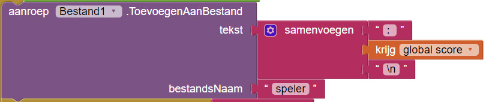
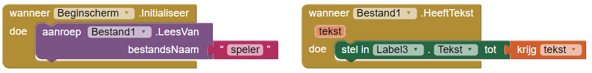
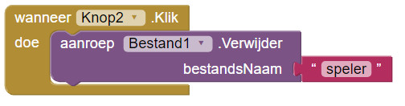

1. Nu moeten we alleen nog de score van de speler tonen die je games gespeeld heeft!

2. Om de score te tonen moet je een aantal blokken van Screen1 aanpassen.

3. In het `aanroep [Bestand1].ToevoegenAanBestand `blok haal je het `krijg [global score] `blok weg en vervang je het door een **Tekst** `samenvoegen` blok.

4. Klik op het  symbool en sleep er een` tekst` blok bij.

5. Zet het` krijg [global score] `blok in het midden en twee lege **Tekst **blokken bovenin en onderin.

6. Het bovenste **Tekst** blok is om een spatie te plaatsen tussen de naam van de speler en de score. Ik heb ": " gebruikt. Zet "\n" in het laatste **Tekst** blok. "\n" is hoe programmeurs aan de computer vertellen om op "Enter" te klikken als het tekst laat zien. Zo ziet het blok er nu uit:  
   

7. In de Ontwerper van het Beginscherm voeg je nog een label toe en haal je daar alle tekst weg. Ga weer naar Blokken, voeg een `wanneer [Beginscherm].Initaliseer` blok toe. Vanuit **Bestand1** sleep het het `aanroep [Bestand1].LeesVan` blok toe en zet je er een **Tekst** blok in. De tekst moet zijn "speler".

8. Goed! Je hebt de tekst gelezen. Nu moet je de tekst laten zien. Sleep het `wanneer [Bestand1].HeeftTekst `blok uit **Bestand1** naar je scherm. Vanuit **Label3** sleep je het `stel in [Label3].[Tekst] tot` blok daarin en zet je `krijg [tekst]` aan het eind. Zo moeten ze er uit zien:  
   

9. Geweldig! Je game is helemaal klaar om gebruikt te worden! Probeer het uit via de emulator of een Android apparaat.

10. Het kan zijn dat je een fout tegenkomt als je een tijdje speelt...de scores verdwijnen van het scherm! Je kunt oude scores weghalen door een "verwijder score" knop aan het beginscherm toe te voegen. Als de speler daarop drukt, wordt het bestand gewist. Als de "verwijder score" knop ingedrukt is, gebruik je het` aanroep [Bestand1].Verwijder `blok onder je **Knop**. Zo ziet het eruit:  
    

