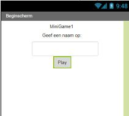

1. Een **beginscherm** kan informatie aan de spelers tonen. Dit wordt ook wel een start- of hoofdscherm genoemd. Je kunt je eigen beginscherm maken door een nieuw scherm toe te voegen en het een naam te geven \(wij kiezen voor 'Beginscherm'\).

2. Wat weet je nog van de Beginner kaarten? Voeg twee labels en één knop toe aan het scherm. Geef het eerste label de naam van je app.

   NB: wij vinden het fijn als het beginscherm gecentreerd is en niet alles helemaal links staat. Klik op je scherm in het **Componenten** menu, dan zet je onder **Eigenschappen** de **UitlijningHorizontaal** op _Midden:3_.

3. Tijd voor iets nieuws! Je kunt input van de speler krijgen met het **TekstVak** \(**Palet &gt; Gebruikersomgeving**\). Sleep er één naar je scherm.

4. Je laat je speler verschillende minigames spelen, dus je moet gaan bijhouden hoeveel spelletjes ze winnen. Sleep een **Bestand** \(**Palet &gt; Opslag**\) naar je scherm. De app zal dit gebruiken om de score van de speler bij te houden!

5. Maak je beginscherm wat netter. Zo ziet ons beginscherm eruit:  
   

   NB: dit is wat wij gedaan hebben, maar je kunt zelf je opmaak bepalen!

6. Hoog tijd om code toe te voegen aan beginscherm. Open de Blokken editor rechtsboven in je scherm.

7. Zoek het `wanneer [Knop1]. Klik` blok en zet er een `aanroep [Bestand1]. ToevoegenAanBestand` blok in vanuit **Bestand1**.

8. Voeg een blanco **Tekst** blok toe aan de bestandsNaam plaats. Zet "speler" in het **Tekst** blok. Dit bestand zal informatie over de speler bewaren. Om input van de speler te krijgen, zal het blok dat je nodig hebt onder het **Tekst** blok zitten en het ziet er zo uit:  
   

   Sleep het naar de tekstplek:  
   

   Dat is het! Je hebt zojuist de input van de speler in het "speler"bestand opgeslagen.

9. Om het blok af te maken gebruik je het `aanroep [TekstVak1]. VerbergToetsenbord` blok van **TekstVak1** en vanuit **Controle** het `sluit venster met waarde resultaat `blok. Zet een tekstblok met "Beginscherm" eraan vast. Zoals dit:
   

10. Prima! Nog één ding, je moet de speler het beginscherm laten zien. Op dit moment laat App Inventor als eerste Screen1 zien. Om het beginscherm te openen als de app opstart kun je deze blokken gebruiken \(in het Screen1 blokken gedeelte\):
    

11. Als je je app via de emulator of Android apparaat uitvoert, kun je zien hoe je beginscherm eruit ziet.

