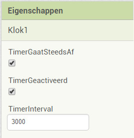
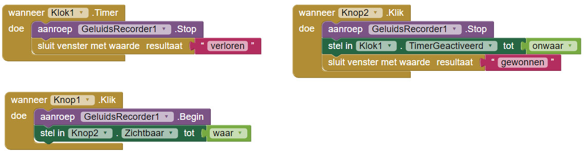
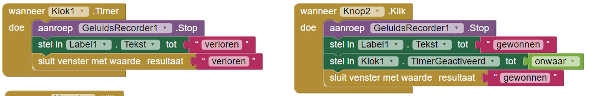
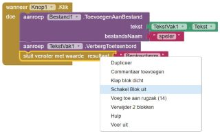

1. Deze app gaat helemaal over minigames! De eerste minigame zal je reflexen testen. Maak een nieuw scherm met de naam "Minigame1".

2. Voeg een label toe en verander de tekst naar "Neem snel een geluid op" \(zo weet de speler wat er verwacht wordt!\). Voeg ook twee knoppen "Opnemen" en "Stop" toe. Zet bij de Stopknop de** zichtbaarheid** uit. Via **Palet &gt; Media** voeg je een **GeluidsRecorder** toe aan je scherm.

3. Nu heb je nog een klok \(**Palet &gt; Sensoren**\) nodig. Klik op de klok in **Componenten** en zet de **TimerInterval** op 3000 in de **Eigenschappen**.  
   

4. Ga nu naar de **Blokken** editor. De klok ga je gebruiken om te zien of de speler snel genoeg een geluid opneemt!

5. Nu moet de minigame bepalen of de speler gewonnen of verloren heeft. Als de speler een geluid opneemt vóór het klokalarm afgaat wint de speler! Zo niet...dan verliest de speler.

6. Sleep twee `wanneer [Knop].Klik` blokken naar het scherm.

7. Sleep dan vanuit GeluidsRecorder het `aanroep GeluidsRecorder1.Begin` in je "opnemen" knop. Om de stopknop zichtbaar te maken, pak je de `stel in [Knop2].Zichtbaar tot` vanuit **Knop2** en zet er een `waar` blok aan vast.

8. Voor de Stopknop voeg je een `stel in [Klok1].Geactiveerd tot `met een `onwaar` blok uit **Logica** toe. Gebruik het blok `aanroep [Geluidsrecorder1].Stop` \(uit **GeluidsRecorder1**\) om de opname te stoppen. Nu hoef je alleen nog het `sluit venster met waarde resultaat` blok te gebruiken met een **Tekst**blok "gewonnen".

9. Vanuit de **Klok1 **blokken pak je het `wanneer [Klok1].Timer` blok. Hier stop je het blok `sluit venster met waarde resultaat` in met een **Tekst**blok "verloren". Om er zeker van te zijn dat de opname gestopt wordt, sleep je hier ook het `aanroep[GeluidsRecorder1].Stop` blok heen. Je blokken zouden er nu zo uit moeten zien:  
   

10. Als je de minigame nu wilt uitproberen voeg je twee `stel in [Label1].Tekst tot` blokken toe. Voeg de **Tekst** "gewonnen" en de **Tekst** "verloren" toe aan de juiste blokken. Zo ziet het er bij ons uit:  
    

11. Geweldig! Voor je de minigame uitprobeert moet je nog één ding doen. Ga terug naar **Beginscherm** en klik met rechts op het `sluit venster met waarde resultaat `blok. Klik dan op **Schakel Blok uit**. Programmeurs gebruiken dit vaak om de computer een stukje code te laten negeren.   
    

12. Want je wil je minigame tonen. Voeg het blok `open een ander scherm schermNaam` toe met een tekstblok "minigame1".

13. Wow! Probeer je spel nu uit! De tekst boven in het scherm zal veranderen en je vertellen of je gewonnen of verloren hebt!

