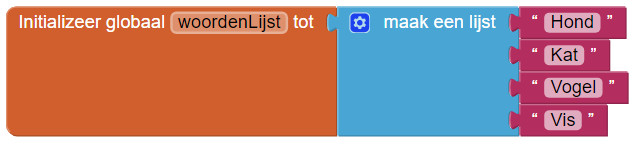
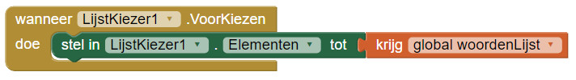
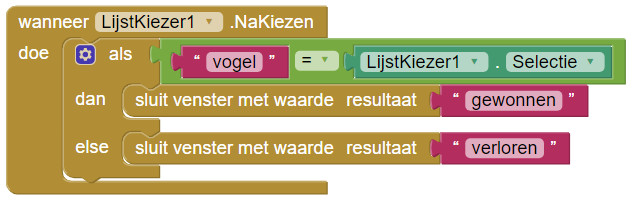

1. Cool, je hebt je eerste minigame gemaakt! Door meer minigames te maken houd je je app interessant voor de spelers. Dus nu gaan we een minigame maken dat gebruik maakt van een **Lijst**.

2. Een **Lijst** is eens tel objecten \(variabelen\) die je bij elkaar opslaat. Denk bijv. aan een boodschappenlijstje. Daarop staan sinaasappels, appels en druiven. Dit zijn objecten, maar ze staan allemaal in dezelfde lijst omdat ze fruit zijn.

3. Voeg een scherm genaamd "Minigame2" toe. Je kunt de **LijstKiezer **\(**Palet &gt; Gebruikersomgeving**\) gebruiken om de speler een object in een lijst te laten kiezen. Voeg er één toe aan het scherm.

4. Ga naar de **Blokken** editor. Voeg een `Initializeer globaal [naam] tot `blok toe en verander "naam" in iets beters: "woordenLijst".

5. Er zit een `maak een lijst` blok onder **Lijsten**; zet het in het scherm. Klik op het symbool  
     
   en voeg meer objecten toe aan de lijst \(wij hebben er vier, maar je mag het aantal zelf bepalen\).

6. Gebruik nu " " blokken om de lege plekken te vullen. Zet er woorden in. Wij gebruiken diverse huisdieren. Zo ziet het er bij ons uit:  
   

7. Bij de **LijstKiezer** blokken zit een `wanneer [LijstKiezer1].VoorKiezen `blok en een `stel in [LijstKiezer1].[Elementen] tot `blok. Zet ze er samen in. Nu hoef je alleen nog maar een `krijg []` **Variabelen** blok erin te zetten en is de **LijstKiezer** klaar! Het zal er zo uitzien:  
   

8. Als de speler een woord kiest, moet je kunnen zien of ze het juiste woord hebben gekozen. Je wilt een `wanneer [LijstKiezer1].NaKiezen` blok hebben om na te kijken wel word de speler koos! Sleep het naar je scherm.

9. Kies een woord uit je lijst \(wij kozen Vogel uit de lijst\). Ga terug naar Ontwerper, voeg een label toe en verander de tekst naar "Kies" en het woord dat je wilt dat de speler kiest \(wij hebben "Kies een huisdier"\).

10. Aangezien we nakijken _of_ de speler het juiste woord kiest, kun je een 'als dan' bepaling gebruiken. Klik op het  
        
    symbool en voeg een 'else' (= anders) toe aan de 'als'.

11. Voor als gebruik je een `[ ] = [ ]` blok uit **Logica**, een **Tekst**blok en het `[LijstKiezer1].[Selectie]` \(het spelersblok\) uit **LijstKiezer**. Als de speler juist kiest, wint hij; zo niet, dan verliest hij.

12. Zo zou het er nu uit moeten zien:  
    

13. OM te zien of het werkt kun je hetzelfde doen als in de eerste Minigame. Voeg twee `stel in [Label1].[Tekst] tot `blokken toe en zet er `gewonnen` en `verloren` bij.

14. Je moet ook het scherm laten veranderen als er op de "Play" knop gedrukt wordt. Probeer het! Dan kun je je nieuwe minigame spelen.

